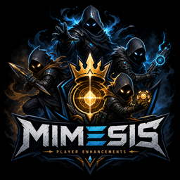

# Mimesis Player Enhancement



> **Warning — use at your own risk.** Mods change how the game runs; things can break. Only download MelonLoader from [melonwiki.xyz](https://melonwiki.xyz/). If you do not trust a pre-built DLL, [build from source on GitHub](https://github.com/Kandru/mimesis-player-enhancements).

One plugin for MIMESIS multiplayer: more players, more mimic voices, voice persistence, join-anytime, statistics, spawn/loot/money scaling, dungeon tweaks, a web dashboard, and more — with a single config file instead of juggling separate mods.

Tested with **MIMESIS 0.3.0** and **MelonLoader 0.7.3**.

## Install

### Mod manager (recommended)

Install through **r2modman**, **Gale**, or another Thunderstore client. The MelonLoader dependency is pulled in automatically.

### Manual

1. Install [MelonLoader 0.7.3+](https://melonwiki.xyz/) on your MIMESIS Steam copy.
2. Extract this package and copy `MimesisPlayerEnhancement.dll` and the `MimesisPlayerEnhancement/` folder into `<MIMESIS>/Mods/`.
3. Start the game once.

Remove older separate mods (MorePlayers, More Voices, MimesisPersistence, JoinAnytime, **MoreMimics**) if you still have them — this mod replaces them.

## Features

| Feature | What it does | Everyone needs the mod? |
|---------|--------------|-------------------------|
| **More Players** | Raise the 4-player cap (default: 32) | No — host only |
| **More Voices** | Record more mimic voice lines per context | No — host only |
| **Persistence** | Keep mimic voices after save/load | No — host only |
| **Join Anytime** | Join a session that already started | **Yes — every player** |
| **Statistics** | Session stats and leaderboard per save slot | No — host only |
| **Web Dashboard** | Browser UI for players, stats, and host moderation | No — host only |
| **Player Announcements** | Toasts for dungeon settings, boss spawns, death stats | No — host only |
| **Spawn Scaling** | Scale mimic/monster spawn budgets by type and player count | No — host only |
| **Loot Multiplicator** | Scale loot quantity by source and item type | No — host only |
| **Money Multiplier** | Scale startup money, goals, scrap, shop prices, and more | No — host only |
| **Dungeon Time** | Extend shift length for larger lobbies | No — host only |
| **Dungeon Size Scaling** | Scale procedural dungeon length by player count | Same config on all machines |
| **Dungeon Randomizer** | Randomize tram pick, layout, map variant, and seed | No — host only |
| **Spectator Transition** | Shorten downed/dead-camera time before spectator | Host + clients for camera timing |

Based on community mods by [NeoMimicry/MorePlayers](https://github.com/NeoMimicry/MorePlayers), [Risikus/More_Voices](https://thunderstore.io/c/mimesis/p/Risikus/More_Voices/), [JoanRLopez/MimesisPersistence](https://github.com/JoanRLopez/MimesisPersistence), and [Shlygly/MimesisJoinAnytime](https://github.com/Shlygly/MimesisJoinAnytime). Please support the original authors as well.

## Config

After the first launch:

```
<MIMESIS>/UserData/MimesisPlayerEnhancement.cfg
```

Edit anytime; most changes apply fully after a restart. Each feature has its own TOML section and master toggle.

Full config reference, build instructions, and contribution guide: [GitHub README](https://github.com/Kandru/mimesis-player-enhancements#config).

## Links

- [GitHub repository](https://github.com/Kandru/mimesis-player-enhancements)
- [Report issues](https://github.com/Kandru/mimesis-player-enhancements/issues)
- [Latest releases](https://github.com/Kandru/mimesis-player-enhancements/releases)
